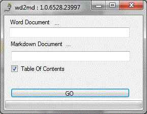
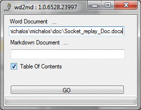
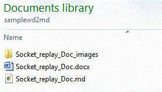
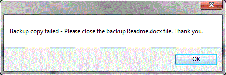
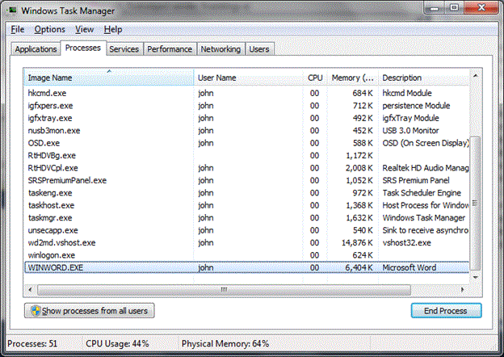
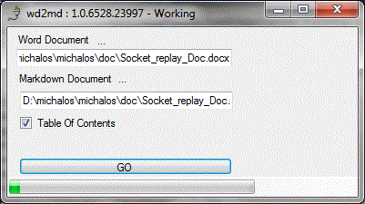
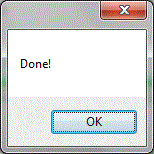
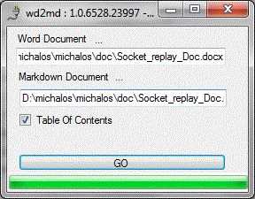
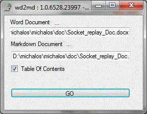

# Word 2 Markdown README
 
----

11/21/2017 3:44:40 PM
This document describes the procedure to convert Microsoft Word documents into Markdown documents. There are many variants of markdown, but fortunately it is a rather limited set. 
# Instructions
The code is a C# Windows application. It has only been tested on 32 and 64 bit Windows 7 operating systems.
Follow these instructions to generate a readme.md and images folder.
 1. Double click  the wd2md.exe file to run the application or select Word2Markdown in the Command list:

 2. To select a Word document (docx), click on the ellipsis (…) under the work document label. A file selection popup dialogue will appear and you can select the Word file you want converted.

 You can then press the GO button and the markdown document will automatically be named the Word document title plus the ".md" extension and placed in the same folder. During the conversions images will get generated and placed in the folder under the markdown document named word document title plus "_image". All images will be placed in this folder.
 Below the word document socket_replay_Doc.docx (word document extension is docx) will be converted into markdown, and the file  socket_replay_Doc.md and the socket_replay_Doc_images folder will be created with a images in the documented converted to gif and copied into this folder.
 

 The wd2md conversion is not fool-proof and there  can be problems.  If the wd2md conversion fails or you interrupt the conversion process, the word backup document copy is left open and can hang the following conversions process.
 

 
 You will need to start the task manager, click to processes and kill thewinword.exe process (running in the background) to release the backup word copy.

 This can be a problem if you are normally using Word for editing.  wd2md not perfect , and won't intentionally harm your system.
 
 3. The wd2md program generates a copy of the Word document (for now Readme.docx) in the same folder as the original word document,  Then the dialog presents a progress bar in the status area at the bottom of the dialog that increments according to the processing of word paragraph.

 
 In case you were wondering the 1.0.6528.23997 is the C# automatic versioning. The 6528 refers to the number of days since jan 1 2000 and the 23997 is the number of seconds since 12AM divided by 2. It will do.
 
 4. When completed a Done dialog pops up, and an OK is required to dismiss the popup and return to the wd2md dialog:

 
 The  wd2md dialog is complete:

 After the Done ok click, the progress bar is dismissed, and the program is ready to convert another word document:

 5. the program locates and saves all inline pictures in the document under the folder images/ in the name format worfile_images/image#.jpg and will cross reference to this image in the markdown
 6. The program generates a Readme.md document with all the mappings.
# Configuration

The Github web site uses markdown as its readme format to describe a repository. This initial goal of this executable was to produce readable Readme.md that included images.

<table>
<tr>
<td>Word  </td>
<td>Markdown </td>
</tr>
<tr>
<td>Heading 1, Heading 2, … styles </td>
<td>Corresponding number of # </td>
</tr>
<tr>
<td>Image </td>
<td>Save image into images/image#.jpg Insert markdown:  </td>
</tr>
<tr>
<td>Bold Font </td>
<td>** text ** </td>
</tr>
<tr>
<td>Underline Font </td>
<td>_ text _ </td>
</tr>
<tr>
<td>Code Style </td>
<td>\t code line1 \t code line2 </td>
</tr>
<tr>
<td>Table </td>
<td>Unclear, just used html to represent table, Remaining problems with paragraph count using table Github: First Header | Second Header ------------ | ------------- Content from cell 1 | Content from cell 2 Content in the first column | Content in the second column </td>
</tr>
<tr>
<td>List </td>
<td>Unordered (bullet) -  * Numbered – #. Etc. </td>
</tr>
<tr>
<td>Hyperlink  </td>
<td>Hyperlink e.g., http://github.com - automatic! [GitHub](http://github.com) </td>
</tr>
<tr>
<td>Task Lists </td>
<td>Unhandled - [x] @mentions, #refs, [links](), **formatting**, and <del>tags</del> supported - [x] list syntax required (any unordered or ordered list supported) - [x] this is a complete item - [ ] this is an incomplete item </td>
</tr>
<tr>
<td>Strikethrough   </td>
<td>~~this~~  - this appears crossed out. </td>
</tr>
</table>
## Manually configurating
There is the ability to manually configure the wd2md application. The file Config.ini is an "ini" file format(sections with keys and values) as shown below. Only Heading1 has multiple entries delimited by a comma. Note, beginning and trailing spaces are removed, however, space inside the text is not.

	[STYLES]
	List  = List Paragraph
	Code  = BoxedCode 
	Title  =      Title
	Heading1  =  Heading 1,Heading1, H1
	Heading2  =  Heading 2
	Heading3  =  Heading 3
The Config.ini file contains the matching styles that get mapped into the corresponding markdown formats. You can add more styles in the ini file, for example, another Heading2 style:

	Heading2  =  Heading 2, H2
The values are parsed as comma separated values, with extra space around the style names removed.
Below shows the internal name, the markdown equivalent and the Word Style name used. 
<table>
<tr>
<td>Name </td>
<td>Markdown </td>
<td>Word </td>
</tr>
<tr>
<td>List </td>
<td> </td>
<td>List Paragraph  </td>
</tr>
<tr>
<td>Code </td>
<td>Indent by tab </td>
<td>BoxedCode (my style name) you can add yours. </td>
</tr>
<tr>
<td>Title </td>
<td> </td>
<td>Title </td>
</tr>
<tr>
<td>Heading1 </td>
<td># </td>
<td>Heading 1 </td>
</tr>
<tr>
<td>Heading2 </td>
<td>## </td>
<td>Heading 2 </td>
</tr>
<tr>
<td>Heading3 </td>
<td>### </td>
<td>Heading 3 </td>
</tr>
</table>

Thus for example the code style is "BoxedCode" but you can change or add another word stye  name. You will note all the styles in this word document are the styles matched by the wd2md application.
# Modification
The program is a C# windows application. Is uses windows office word interoperability to do the word document manipulation. Originally the program was a VBA program, but saving the images could not be done in a reasonable amount of time. So the program was rewritten into visual studio C# 2010, which was quite simple.
There is only one C# class to perform the Word to Markdown conversion. This class is called WordAutomation and does all the word automation and conversions.  Of interest is that Word styles can vary from document to document.  Under the   WordAutomation class definition are the arrays that define the styles to search for to map heading, code, etc. into the corresponding Markdown equivalent. These straing arrays are currently defines as:

	        public string []  ListStyle = {"List Paragraph"};
	        public string []  CodeStyle = {"BoxedCode"};
	        public string []  TitleStyle = {"Title"};
	        public string []  Heading1 = {"Heading 1", "Heading1", "H1"};
	        public string []  Heading2 = {"Heading 2"};
	        public string []  Heading3 = {"Heading 3"};

You can modify these string and recompile the program to effect the changes.. Obviously an ini file or .Net config file could be used to modify these mappings.
